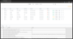
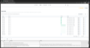
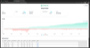
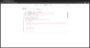

# JT Trader

[](LICENSE)
[](https://www.typescriptlang.org/)
[](https://nodejs.org/)
[](https://github.com/ccxt/ccxt)
[](https://github.com/jt-lab-com/jt-lib)


JT Trader is a powerful algorithmic trading platform built on modern technology stack. The platform provides a complete set of tools for creating, testing, and deploying trading strategies.

## 📋 Table of Contents

- [🚀 Key Features](#-key-features)
- [🖼️ Screenshots](#️-screenshots)
- [📋 Requirements](#-requirements)
- [🛠 Installation](#-installation)
- [⚙️ Configuration](#️-configuration)
- [🚀 Running](#-running)
- [📚 Documentation](#-documentation)
- [📄 License](#-license)
- [🤝 Support](#-support)
- [🔗 Related Projects](#-related-projects)

## 🚀 Key Features

- **Strategy Development** - Create trading strategies using TypeScript and modern API
- **Strategy Testing** - Built-in tester for validating strategies on historical data
- **Real-time Trading** - Run strategies in real-time mode
- **Web Interface** - User-friendly web interface for strategy management
- **Reporting** - Detailed analytics and reports on trading operations
- **Cross-Platform** - Works on Windows, macOS, and Linux
- **Cloud Ready** - Can be deployed on cloud platforms

## 🖼️ Screenshots

<div align="center">

[](img/runtime-intro.png)
[](img/create-runtime-intro.png)
[](img/tester-intro.png)
[](img/tester-full-report-intro.png)
[](img/strategy-files-intro.png)
[](img/config-intro.png)
[](img/create-scenarion-tester-intro.png)

</div>

## 📋 Requirements

- Node.js v18.x (not tested yet on other versions)

## 🛠 Installation


**1. [📥 Download Launcher](https://docs.jt-lab.com/installation/#1-installation-via-launcher)**

**2. [🐳 Docker Installation](https://docs.jt-lab.com/installation/#installing-docker)**

### 📦 From GitHub
1. Clone the repository:
```bash
git clone --recurse-submodules git@github.com:jt-lab-com/jt-trader.git
```
Go to the project directory and install dependencies:

2. Install dependencies:
```bash
cd jt-trader && yarn
```

3. Configure environment variables by copying `.env.example` to `.env`.

## ⚙️ Configuration

### Automatic configuration

Run the following command to automatically generate a `.env` file with all required environment variables:
```bash
ts-node scripts/setup-environment.ts
```

### Manual configuration

Create a `.env` file in the project root directory by copying `.env.example` and set the following environment variables:

```env
# Main settings
PORT=8080
SITE_API_HOST=https://jt-lab.com
STANDALONE_APP=1

# Trading engine mode: both, realtime, tester
ENGINE_MODE="both"

# File and directory paths
DATABASE_URL="file:/path/to/your/project/storage.db"
ROLLUP_TS_CONFIG=tsconfig.bundler.json
STRATEGY_FILES_PATH=/path/to/your/project/strategy-source/src
MARKETS_FILE_PATH=markets.json
ARTIFACTS_DIR_PATH=/path/to/your/project/artifacts
HISTORY_BARS_PATH=downloaded-history-bars
LOGS_DIR_PATH=artifacts

# Redis (optional - system can work with file cache)
# REDIS_URL=redis://localhost:6379
```

### Environment Variables

| Variable                             | Description                                                                                                  | Example                                     |
|--------------------------------------|--------------------------------------------------------------------------------------------------------------|---------------------------------------------|
| `PORT`                               | Port for running the application                                                                             | `8080`                                      |
| `SITE_API_HOST`                      | Base URL for site API                                                                                        | `https://jt-lab.com`                        |
| `STANDALONE_APP`                     | Local mode operation (1 = enabled)                                                                           | `1`                                         |
| `ENGINE_MODE`                        | Trading engine mode                                                                                          | `"both"`, `"realtime"`, `"tester"`          |
| `DATABASE_URL`                       | **Absolute path** to SQLite database file                                                                    | `"file:/path/to/your/project/storage.db"`   |
| `STRATEGY_FILES_PATH`                | **Absolute path** to strategy source code                                                                    | `/path/to/your/project/strategy-source/src` |
| `ROLLUP_TS_CONFIG`                   | Path to TypeScript configuration                                                                             | `tsconfig.bundler.json`                     |
| `ARTIFACTS_DIR_PATH`                 | Path to strategy reports directory                                                                           | `/path/to/your/project/artifacts`           |
| `HISTORY_BARS_PATH`                  | Path to historical data directory                                                                            | `downloaded-history-bars`                   |
| `LOGS_DIR_PATH`                      | Path to logs directory                                                                                       | `artifacts`                                 |
| `REDIS_URL`                          | Redis connection URL (optional)                                                                              | `redis://localhost:6379`                    |
| `ACCESS_SECRET`                      | Secret code used for public servers to prevent unauthorized access                                           | `your_secret_key`                           |
| `CACHE_DRIVER`                       | Specifies where the application cache is stored. Available options: `redis` or `disk` (local database file). | `redis`                                     |
| `ACCOUNT_LIMIT_RUNTIMES`             | Maximum number of concurrently running runtimes. Default: 5                                                  |                                             |
| `ACCOUNT_LIMIT_OPTIMIZER_SCENARIO`   | Maximum number of sets for script optimization. Default: 15                                                  |                                             |
| `ACCOUNT_LIMIT_API_CALL_PER_SEC`     | Maximum allowed number of exchange API calls per second. Default: 5                                          |                                             |
| `ACCOUNT_LIMIT_TESTER_MAX_PROCESSES` | Maximum number of concurrently running processes for the tester. Default: 5                                  |                                             |
| `ACCOUNT_LIMIT_TESTER_MAX_MEMORY`    | Maximum memory (in MB) allocated for tester processes. Default: 1024                                         |                                             |
| `ACCOUNT_LIMIT_TESTER_EXEC_TIMEOUT`  | Tester script execution time limit (in seconds). Default: 300                                                |                                             |
| `ACCOUNT_LIMIT_REPORT_MAX_SIZE`      | Maximum report file size (in MB). Default: 1                                                                 |                                             |
| `LIMIT_ORDER_BOOK`                   | Defines the number of order book rows to load. Default: 5                                                    |                                             |

## 🚀 Running

Build the project:

```bash
yarn build:prod
```

Run in production mode:
```bash
yarn start:prod
```

## 📚 Documentation

Detailed documentation is available at [docs.jt-lab.com](https://docs.jt-lab.com/jt-trader/getting-started/).

## 📄 License

JT Trader is dual-licensed:

- 🟢 **Free** for personal, educational, and open-source use (AGPLv3)
- 🔒 **Commercial use** requires a [paid license](mailto:am@jt-lab.com)

## 🤝 Support

- [Official Website](https://jt-lab.com)
- [Documentation](https://docs.jt-lab.com/jt-trader/getting-started/)
- [GitHub Issues](https://github.com/jt-lab-com/jt-trader/issues)

## 🔗 Related Projects

- [jt-lib](https://github.com/jt-lab-com/jt-lib) - Library for creating trading strategies
- [Documentation](https://docs.jt-lab.com) - Complete project documentation

---

**JT Lab** - Professional tools for algorithmic trading
